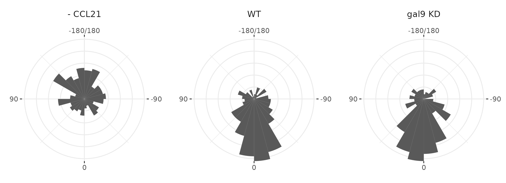
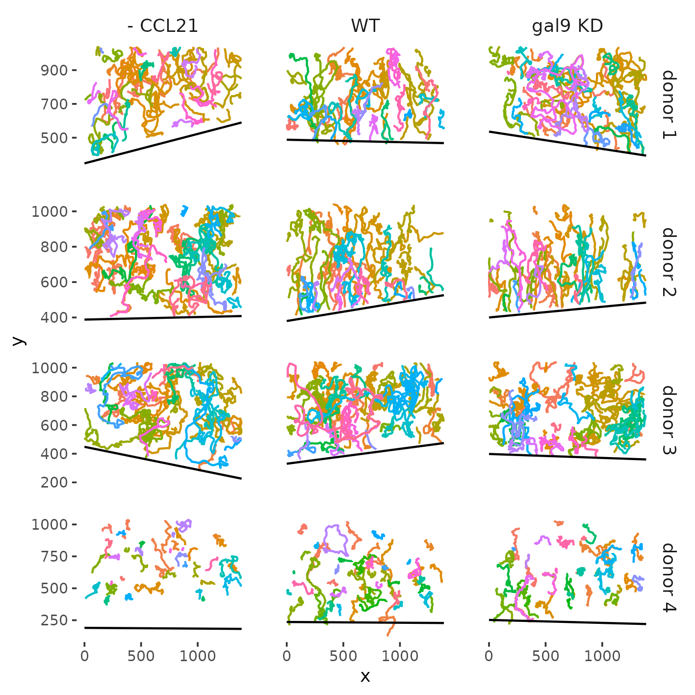
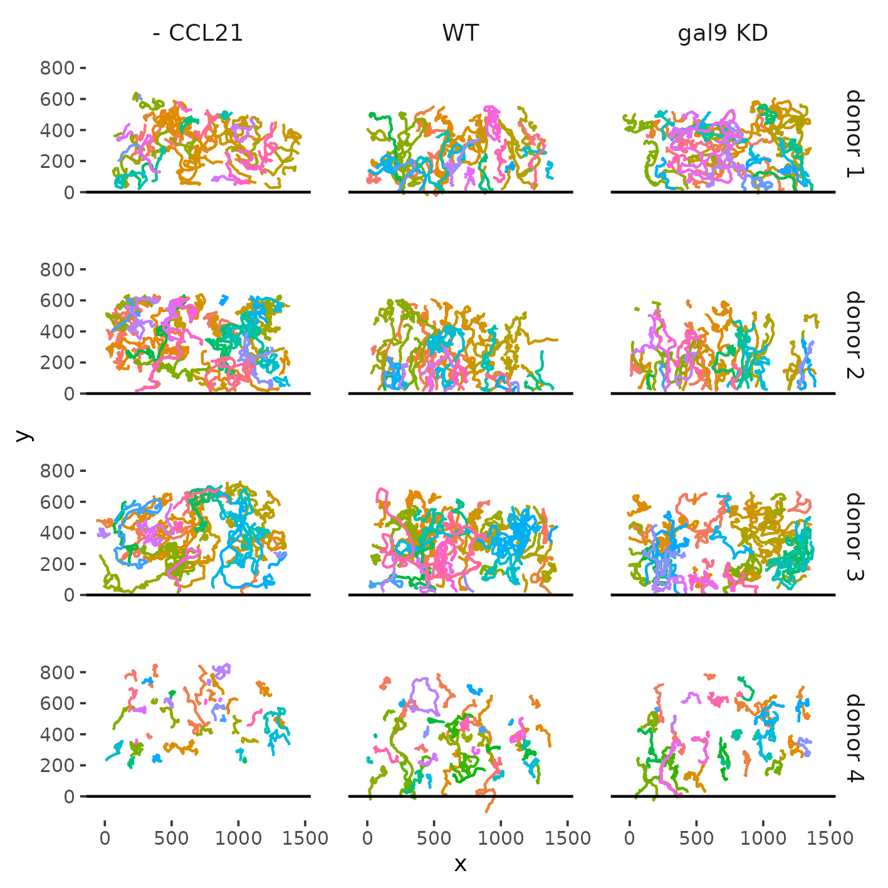

# Chemotaxis analysis Gal-9 Knockdown

This repository contains the code and data used to perform the chemotaxis analysis in the paper [Galectin-9 regulates dendritic cell polarity and uropod contraction by modulating RhoA activity](
https://doi.org/10.1083/jcb.202404079).

# Data

 

The data consists of cell trajectories (`tracks.csv`) and the border of the area containing CCL21 (`borders_CCL21.csv`). Trajectories were shifted and rotated such that the border of the area with CCL21 is aligned with the x-axis.




# How to run

1. **Install Required R Packages**  
   Ensure the following R packages are installed:
   - `dplyr`
   - `ggplot2`
   - `celltrackR`
   - `simpleboot`
   - `boot`
   - `patchwork`
   - `ggbeeswarm`
   - `see`

   You can install them using:
   ```r
   install.packages(c("dplyr", "ggplot2", "simpleboot", "boot", "patchwork", "ggbeeswarm", "see"))
   devtools::install_github("celltrackR/celltrackR")

2. **Run the Analysis Script**
    Execute the analysis.R script to generate the figures:
    ```
    Rscript run_analysis.R
    ```
